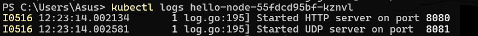
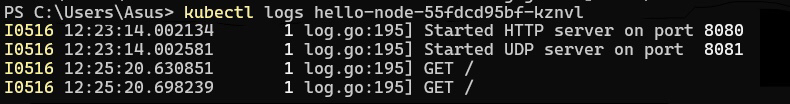

## 1. Compare the application logs before and after you exposed it as a Service.

Setelah service di-expose, maka log akan mencatat setiap request yang diterima oleh service. Seperti halnya dalam contoh berikut ketika dilakukan refresh dalam aplikasi sehingga log akan bertambah setiap waktu.

Sebelum:

Setelah:

Dapat dilihat bahwa catatan log juga akan mencatat permintaan yang masuk yang kemudian akan dialihkan melalui Service yang dapat menyediakan akses eksternal ke aplikasi, seperti permintaan GET /

## 2. Notice that there are two versions of `kubectl get` invocation during this tutorial section. The first does not have any option, while the latter has `-n` option with value set to
`kube-system`.

Dengan menggunakan -n, service yang diinginkan berarti merupakan service yang berada di dalam namespace tersebut, sehingga dapat menitikberatkan fokus get pada namespace setelah query -n. Hal ini akan diperlukan ketika terdapat beberapa service yang memiliki nama yang sama, tetapi dengan tujuan berbeda dan memiliki namespace yang tersebar.

## 3. What is the difference between Rolling Update and Recreate deployment strategy?
Rolling Update digunakan oleh Kubernetes sebagai sebuah strategi deployment di mana pods akan diupdate yang akan menggantikan versi lama dengan pod dengan versi yang baru, sehingga waktu downtime dapat diminimalisasi dan dapat melakukan rollback untuk kembali ke versi yang lebih lama secara stabil.

Sedangkan Recreate merupakan sebuah strategi yang mana sebelum pods dengan versi terbaru dibuat, pods dengan versi lama harus diterminate terlebih dahulu sehingga dapat meningkatkan waktu downtime saat melakukan update. Strategi ini pada umumnya diimplementasikan ketika aplikasi hanya dapat menjalankan pod dengan versi baru tanpa menjalankan versi yang lama secara bersamaan.

## 4. Try deploying the Spring Petclinic REST using Recreate deployment strategy and document your attempt.
Deployment dengan menggunakan Recreate Strategy berhasil dijalankan dengan melakukan tutorial yang didapatkan dari https://dev.to/cloudskills/kubernetes-deployment-strategy-recreate-3kgn. kubectl edit deployments spring-petclinic-rest dijalankan terlebih dahulu, kemudian versi akan diedit melalui file text. Pada akhirnya, Kubernetes pun akan menjalankan Recreate Deployment Strategy.

## 5. Prepare different manifest files for executing Recreate deployment strategy.
Dilampirkan pada deploymentrecreate.yaml

## 6. What do you think are the benefits of using Kubernetes manifest files? Recall your experience in deploying the app manually and compare it to your experience when deploying the same app by applying the manifest files (i.e., invoking kubectl apply -f command) to the cluster.
Dengan adanya pendekatan yang lebih terstruktur saat melakukan deployment, penggunaan manifest files Kubernetes memberikan keuntungan yang lebih mudah karena dapat mempermudah pemeliharaan konfigurasi dan juga konsistensi di environment yang berbeda-beda. Proses deployment juga lebih mudah dilakukan, cepat, dan sederhana dengan menggunakan satu perintah untuk melakukan deployment yaitu kubectl apply -f. Karena masalah deployment dan juga infrastruktur telah diserahkan kepada Kubernetes, maka pengembang pun dapat lebih fokus mengembangkan aplikasi yang diperlukan.
